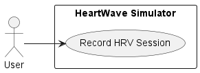

# COMP 3004 Project

## Team Members

- Danil Kuprin
  - UML Diagrams
  - Use Cases
  - Initial design of sessions
  - Initial connection of GUI to simulation
  - Initial session history design
  - Code review
- David Zhang
  - Refactor of sessions
  - Running and summary metrics
  - State management
  - Coherence indicator widget
  - Pulse sensor interruptibility
  - Code review
- Mohajer Farhadpur
  - CI
  - Initial GUI design
  - Pulse sensor
  - Battery sensor
  - Breath pacer widget
  - Heart-rate graph widget
  - Code review
  - Traceability Matrix

## Demo

You can watch a screen recording of the app on [Loom](https://www.loom.com/share/ca1194a9b9174c9fa0a05e862dfd27c2).

## Setup

Ensure the course VM has the required dependencies installed before attempting to build the app.

```sh
sudo apt update && sudo apt install clang-8 libqt5charts5-dev
```

## Design

Like most applications, this project is split into 4 major parts; GUI, sensors,
logic, and persistence. Each will be discussed in turn.

### Logic

Let us begin this discussion of the application with a survey of the application
logic. Everything is rooted in the `AppState` struct, which provies the API to
which the GUI and sensors send and receive data. It operates quite like a state
machine, transitioning between the IDLE, RECORDING, and REVIEWING states
throughout the application's lifecycle. The data the struct holds depends on
this state, and is stored in a variant to reduce the chance that the incorrect
state members are accessed at any given time. This could, in fact, be used to
directly represent which state the application is in, but it was decided to use
a separate enum to minimize disruption to the rest of the project code.

This design focusing on a single API was chosen for its simplicity (for API
users) and for concentrating app logic in one place. A more involved API with
multiple interacting objects would require managing multiple object lifetime
without a clear mechanism for describing dependencies. This single API method
means that initializing the program is a matter of initializing the API, and
destroying the API automatically handles clean-up tasks.

### Sensors

There are two simulated sensors in this project, one for the battery, and one
for the pulse of the user. They are as simple as can be, and make use of the
'push' model. This allows the app to essentially 'go to sleep' when there is
nothing to do without any need for heuristics about when there is and isn't
activity. Each simulated sensor runs off a timer, which triggers a function call
that updates application state.

The simulation of interruptions to the pulse sensor was initially going to be
implemented directly within the sensor class, but it was decided that it makes
sense for it to be handled in the plumbing instead, which is where it resides at
the time of submission. This was (again) for simplicity and ease of
implementation. The framework for a more complex system is implemented, but the
details were deemed unecessary and so left fallow.

### Persistence

Session information is persisted to disk using the `SessionHistory` class. This
is a concession to the simplicity of the project and the small number of
expected sessions. A more involved system would likely call for a provider of
some description that is dependency injected into the app logic at
initialization time. We don't have to do any of that. In fact, the
implementation has a hardcoded file name and path that it expects session data
to be stored at, and will load the file in bulk. Loading all the sessions at
once from disk is done also for simplicity, since we don't expect to need to be
able to store hundreds or thousands of previous sessions each with thousands of
samples.

This session data is stored in a trivial binary format with a header block and
zero or more data blocks. For performance and simplicity, the stored data is
byte-for-byte identical to the in-memory representation. We assume that the
produced binary will not need to be device portable, so we don't have to worry
about word endianness. The entire format is described in the tables below:

#### File Header

 Bytes  | Type | Description
 -------|------|------
   0-7  | u64  | Format version
   8-15 | u64  | Number of sessions
  16-.. |      | Sessions

#### Session Block

 Bytes  | Type | Description
 -------|------|------------
   0-7  | f64  | Percent time at high coherence
   8-15 | f64  | Percent time at medium coherence
  16-23 | f64  | Percent time at low coherence
  24-31 | f64  | Average coherence score
  32-39 | f64  | Achievent score
  48-55 | u64  | Recording length
  56-63 | u64  | Session ID
  64-71 | u64  | Recording time
  72-79 | u64  | Sample count
  80-.. | \[Sample\] | Samples

#### Sample

 Bytes  | Type | Description
 -------|------|------------
   0-7  | u64  | Time since the sensor started
   8-15 | u64  | Time since previous sample
  16-23 | u64  | Instantanous heart rate (beats per minute)

Each file has at least one file header, followed by zero or more session blocks.
For implementation convenience, each session block is stored in memory as two
structs: `Session` and `Summary`. This allows `Session` to also be used when
recording sessions. These structs handle serialization and deserialization of
their own data, and are otherwise POD-like data structures.

### GUI

The GUI is a simple single-document interface with a fixed-size window to ease
implementation. Five custom widgets were implemented for this application, all
of them simple derivations of existing Qt widgets. There is nothing particularly
special about the implementations, except for the lack of slots in `MainWindow`.
This was intentional as a way to isolate interactions with QT to the
`init_widgets` and `connect_sensors` functions.

## Simulation

A number of features were stubbed out to satisfy the requirements of the project:

- Battery sensor (not connected to an actual battery)
- Pulse sensor (not connected to an actual sensor, reads from a file on disk)
- Heart-rate coherence scores (sourced from a random number generator)

## Other Notes

- The application logic explicitly chose to forgo use of the Qt framework
(except for debug log messages) so that it could (in theory) be transplanted
into an actual device.
- The entire project is only 969 significant lines of C++.
- Patterns used in our code
  - Mediator (`AppState`)
  - Observer (`QTimer`, signals and slots)

## Use Cases

### Main Use Case: Record HRV Session

**Primary Actor:**
User

**Precondition:**
The device battery is charged.

**Postcondition:**
A session is created, with instantaneous HRV data and summary metrics recorded and persisted to history.

**Main Success Scenario**:
  1.	User presses the play button.
  2.	Application displays HRV graph and HRV statistics in real-time.
  3.	User presses stop button.
  4.	Application displays HRV session general statistics.
  5.	Application stores session summary in memory.
  6.	Application ready to continue working.

**Extensions:**
- Battery goes out of charge:
	1. Application stops the current session.
  2. Application shuts down the UI.

- Sensor stops receiving user data:
  1.	Application stops recording the data.
  2.	Application HRV generation pauses.
  3.	Application waits for signal to be restored.



See the `doc` folder for UML class and sequence diagrams.

## Traceablility Matrix

ID | Requirement | Use&nbsp;Case | Implemented by | Tested by
---|-------------|---------------|----------------|----------
1  | The screen has an active pulse reading indicator. | Main&nbsp;use&nbsp;case | `MainWindow` | Start a new session and check if a pulse icon is displayed on the top left corner.
2  | The device can be turned on and off using a button. | Main&nbsp;use&nbsp;case | `MainWindow` | Toggle the power button on the main view and check if the other controls are enabled and disabled.
3  | The screen has a coherence level indicator. | Main&nbsp;use&nbsp;case | `MainWindow`, `CoherenceIndicatorWidget` | Start a new session and check for the three lights next to the pulse indicator to change status.
4  | The user can create a new session. | Main&nbsp;use&nbsp;case | `MainWindow`, `SessionHistory`, `Session` | Press the start button on the main view and check if a new session is created and started.
5  | The user can stop a running session. | Main&nbsp;use&nbsp;case | `MainWindow`, `SessionHistory`, `Session` | Press the stop button on the main view when a session is in progress, and check if it stops.
6  | The user can browse past sessions. | Main&nbsp;use&nbsp;case | `MainWindow`, `SessionHistory`, `Session` | Start a new session and stop it, and check if a new entry is added to the session history sidebar.
7  | The user can delete a passt session. | Main&nbsp;use&nbsp;case | `MainWindow`, `SessionHistory`, `Session` | Press the delete button below the session history list when a past session is selected and no active session is in progress, and check if the session is removed from history.
8  | Session history is persisted between app restarts. | Main&nbsp;use&nbsp;case | `SessionHistory`, `Session` | Make changes to session history, restart the app, and check if the changes are persisted.
9  | The session screen must display an HRV graph. | Main&nbsp;use&nbsp;case | `MainWindow`, `HRVGraphWidget` | `PulseSesnsor` | Start a session and check if heart rate data are displayed as a line chart in real-time.
10 | Session screen must display a breath pacer widget with a 10 second interval. | Main&nbsp;use&nbsp;case | `MainWindow`, `BreathPacerWidget` | Start a session and check if a breath pacer in form of a progress bar periodically changes.
11 | The session screen must display three numerical metrics: current coherence score, session duration, and achievement score. | Main&nbsp;use&nbsp;case | `MainWindow`, `Session` | Start a session and check if the numerical metrics at the bottom of the session view are updated regularly.
12 | A completed session must display a session summary view containing percentage of time in different coherence levels,  average coherence, length of session, achievement score, and the entire HRV graph. | Main&nbsp;use&nbsp;case | `MainWindow`, `Session` | Stop a session and check if the summary information is displayed in the session view. Similarly, select a past session from the session history sidebar and check if the summary information is displayed in the session view.
13 | There is an option to wipe all stored data from the device. | Main&nbsp;use&nbsp;case | `MainWindow` | Press the trash can button on below the session history view, and check if all session data is deleted. Restart the app to check that persisted data is also cleared.
14 | The screen has a battery charge indicator. | Main&nbsp;use&nbsp;case | `MainWindow`, `BatteryIndicatorWidget`, `BatterySensor` | Start the app and check if a battery indicator is displayed on the top right corner of the screen and that the charge drops in real-time.
15 | A beep goes off when a new coherence level is reached. | Main&nbsp;use&nbsp;case | `MainWindow` | Start a session and check if a system beep is played whenever coherence level changes.
16 | When the battery charge is about to end, the device saves the session and turns off. | Low&nbsp;battery | `MainWindow`, `BatterySensor` | Start a session, wait until the battery level reaches zero, and check if the session is stopped and the device is turned off.
17 | When the pulse sensor is interrupted, the HRV graph and metrics stop being updated. | Pulse&nbsp;sesnor&nbsp;interruption | `MainWindow`, `PulseSensor` | Start a session, press and hold the sensor interruption button on the session screen, and check if the metrics and graph stop being updated until the button is released.
